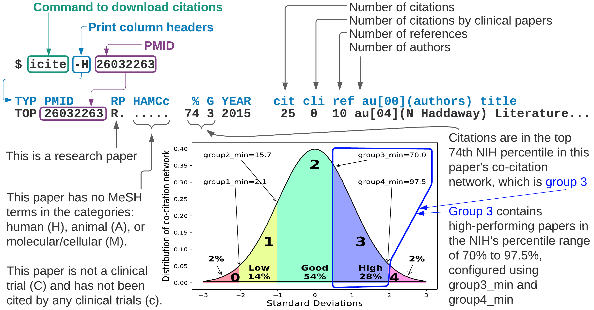

# [**PubMed**](https://pubmed.ncbi.nlm.nih.gov) ID (PMID) Cite
Augment a PubMed literature search by linking 
data downloaded from [**NIH's Open Citation Collection (NIH-OCC)**](https://icite.od.nih.gov)
for researcher-specified [**PubMed**](https://pubmed.ncbi.nlm.nih.gov) IDs (PMIDs)
using the command line
rather than clicking and clicking and clicking on
[**Google Scholar**](/doc/images/README_twitter.md)
*Cited by N* links.

## Usage
### Download citations from the command line

The NIH percentile (`%`) is NIH's ranking of a paper among its co-citation group.

The NIH percentile (`G`) grouping is part of this project and helps to place lower performing papers in groups `0` or `1` at the back of a sorted list so the better performing papers in groups `2`, `3`, and `4` are easier to see. 

New papers appear at the beginning of a sorted list, no matter how many citations they have to better facilitate researchers in finding the latest discoveries.


### Download citations for all papers returned from a PubMed search
Make a copy of `src/bin/dnld_pmids.py` and add your PubMed search to the end of the `queries` list.

There are two PubMed searches in this example:
  * `systematic review AND "how to"[TI]`
  * `Orcinus Orca Type D`

The PubMed search results are saved to specified filenames such as `systematic_review.txt` to be grepped and sorted.
```
def main():
    """Download PMIDs returned for a PubMed query. Write an iCite report for each PMID"""
    queries = [
        # Output filenames               PubMed query
        # -----------------              -----------------------------------
        ('systematic_review.txt',        'systematic review AND "how to"[TI]'),
        ('rarely_seen_killer_whale.txt', 'Orcinus Orca Type D'),
    ]

    obj = PubMedQueryToICite(force_dnld=True, prt_icitepy=None)
    dnld_idx = obj.get_index(sys.argv)
    obj.run(queries, dnld_idx)
```

## PubMed vs Google Scholar
<p align="center">

</p>

In 2013, Boeker et al. recommended that a scientific search interface contain five integrated search criteria.
PubMed implements all five, while Google did not in 2013 or today.

Google's highly popular implementation of the forward citation search through their ubiquitous "Cited by N" links
is a "Better" experience than the PubMed's "forward citation search" implementation.

But if your research is in the health sciences and
you are amenable to consider working from the [command line](#command-line-interface-cli),
you can use PubMed in your browser plus
citation data downloaded from the NIH using the command-line  using *pmidcite*.
The NIH's citation data includes a paper's ranking among its co-citation network.

## What is in PubMed?
Take a [**quick tour**](https://www.nlm.nih.gov/pubs/techbull/ma20/brief/ma20_pubmed_essentials.html) of [**PubMed**](https://pubmed.ncbi.nlm.nih.gov)     


PubMed is a search interface and toolset used to access over 30.5 million article records from databases like:
* **MEDLINE**: a highly selective database started in the 1960s
* **PubMed Central (PMC)**: an open-access database for full-text papers that are free of cost
* Additional content like books and articles published before the 1960s


Copyright (C) 2019-present, DV Klopfenstein. All rights reserved.

<!--
  Title: PubMed ID (PMID) Cite
  Description: Augment your PubMed literature search with forward/backward citation chaining (snowballing) using NIH citation data
  Author: dvklopfenstein
  -->
<meta name='keywords' content='CitedBy, PubMed, PMID, forward citation, backward citation, forward snowball, backward snowball, literature review, citation downloader'>
